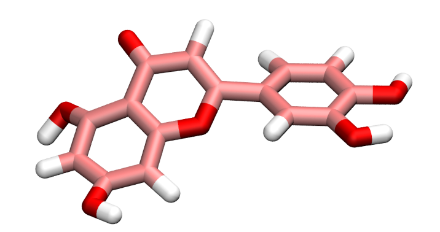

# Molecule templates for LAMMPS 

This repository contains molecule and parameter files compatible with LAMMPS. The initial
molecule topologies were downloaded from the ATB, and the parameters are from the GROMOS force field.

## Full molecule list

- [nitrogen](nitrogen_N2)
- [methane](methane_CH4)
- [carbondioxide](carbondioxide_CO2)
- [decane](decane_C10H22)
- [luteolin](luteolin_C15H10O6)
- [ethane](ethane_C2H6)
- [acetronitrice](acetronitrice_C2H3N)
- [water](water_H2O)
- [ethanol](ethanol_C2H5OH)
- [toluene](toluene_C7H8)
- [propane](propane_C3H8)

